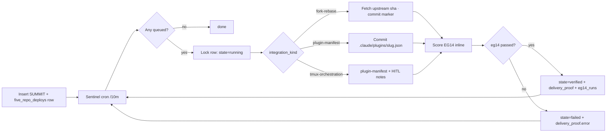

# Architecture V7 — Autonomous Deploy for the Five Repos

## Problem statement

Three pain points from the product owner, documented verbatim: (1) agents work sequentially instead of in parallel with inter-agent communication, (2) when the human stops pushing, the system goes dormant, (3) the runner ghost-successes — reports `state=verified` without producing deliverables. The fix is structural, not procedural.

## Invariants (must never be violated)

1. **Ghost-success is structurally impossible.** Enforced by `trg_prevent_ghost_success` on `summit_chat_dispatch`. Any `UPDATE … SET state='verified'` that lacks `{hard_verification, github_commits, eg14_summary, smoke_test, supabase_artifacts, supabase_migrations}` raises SQLSTATE 23514 and logs CRITICAL to `honesty_violations`. Closed state enforces the weaker bar of any non-empty `delivery_proof`.
2. **Every terminal state carries real evidence.** `delivery_proof` JSONB is the single source of truth for what actually happened.
3. **Guardrail self-enforces for the sentinel itself.** When the sentinel writes its own SUMMIT delivery_proof, the row is inserted in `queued` and flipped to `verified` only with evidence — same code path as every other producer.
4. **Pairing rule preserved.** ZoneWise + BidDeed deploy signals always move together through `five_repo_deploys`.

## Data plane

```
five_repo_deploys (tracker)    summit_chat_dispatch (work unit)    eg14_runs (gate points)
        │                               │                                   │
        └──► summit_id ◄────────────────┤                                   │
                                        └──► summit_id ◄────────────────────┘

honesty_violations ◄── trg_prevent_ghost_success   v_five_repo_deploy_status (public, anon-read)
                                                   v_summit_health           (public, anon-read)
                                                   v_honesty_violations_…    (public, anon-read)
                                                   v_open_hitl_tasks         (public, anon-read)
```

- `five_repo_deploys` — one row per upstream repo (5 rows today). Columns: `repo_slug`, `integration_kind`, `target_host_repo`, `repoeval_score`, `verdict`, `state`, `eg14_score`, `eg14_passed`, `delivery_proof`, `summit_id`.
- Integration kinds: `fork-rebase` (git-only), `plugin-manifest` (commits `.claude/plugins/<slug>.json` to target), `plugin-install` (alias of plugin-manifest), `tmux-orchestration` (plugin-manifest + HITL note for tmux setup).
- Views are the public surface for the GH Pages dashboard. `anon` role has SELECT only.

## Control plane



## Execution layers

| Layer                       | Lives                                                          | Responsibility                                                                                        |
| --------------------------- | -------------------------------------------------------------- | ----------------------------------------------------------------------------------------------------- |
| Guardrail (schema)          | Supabase (`trg_prevent_ghost_success`)                         | Block dishonest state transitions. Logs to `honesty_violations`. Zero runtime dependency.             |
| Sentinel (orchestrator)     | GitHub Actions on `cli-anything-biddeed` (`cron */10`)          | Poll five_repo_deploys, execute handler, write delivery_proof, score EG14.                           |
| Handlers (per kind)         | Python script in the sentinel workflow                         | Do the actual work: git sync marker, plugin manifest commit, HITL note emission.                     |
| Dashboard (observability)   | GitHub Pages on `everest-content/docs`                         | Live view of deploy queue, HITL tasks, SUMMIT health, honesty-violation trend. Auto-refresh 60s.    |
| Inter-agent comms           | Supabase Realtime on `five_repo_deploys` + `summit_chat_dispatch` | Optional — agents subscribing to postgres_changes can coordinate without polling.                    |

## Zero-HITL boundary

One-time bootstrap is unavoidable (cannot generate and store secrets from inside the chat without a human touching the vault). After bootstrap, the system is hands-off:

| Bootstrap (one-time, ~5 min)                   | Autonomous (forever after)                          |
| ---------------------------------------------- | --------------------------------------------------- |
| `SUPABASE_SERVICE_ROLE_KEY` in GHA secrets     | Sentinel cron runs every 10 min unattended         |
| `EVEREST_GH_PAT` in GHA secrets (already have) | New SUMMITs auto-picked on next tick               |
| Pages enabled on `everest-content/docs`        | Dashboard refreshes from Supabase every 60s        |
| `config.js` with anon key on Pages site        | Anon key is public by Supabase design — safe       |

## Why this solves each of the three pain points

### 1) Sequential → Parallel

The sentinel iterates over all queued deploys in a single run. Each handler is independent. For true concurrency (within one tick), Python's `concurrent.futures.ThreadPoolExecutor` around `claim_and_run` — left as a v7.1 follow-up. Inter-agent comms: Supabase Realtime subscription on `five_repo_deploys.state` lets other agents react without polling.

Oh-my-claudecode (REPOEVAL 86/100, DELTA adoption) is kept for the case where Claude Code sessions on Hetzner need team orchestration. It is NOT the orchestrator — SUMMIT dispatch remains canonical.

### 2) Dormancy → Continuous

The sentinel cron runs on `*/10` regardless of human activity. `five_repo_deploys` rows are the queue. The guardrail is the enforcement. The dashboard is the window. None of the three requires a human to be present.

If the cron ever fails for > 1 hour, the Grafana panel on `honesty_violations WHERE domain='summit_dispatch' AND severity IN ('CRITICAL','HIGH')` will be flat — which is itself a signal (expected occasional noise if runners are trying to ghost).

### 3) Ghost-success → Schema-enforced honesty

Already deployed. Trigger blocks at the database layer. No possible path where a state=verified row lacks evidence. The sentinel's own writes pass the guardrail because every handler returns a `hard_verification` object + commit sha, which the updater bundles into `delivery_proof`.

## The five repos — integration plan

| # | Repo                        | Kind                 | Target                                | RepoEval | Priority | Notes                                                             |
| - | --------------------------- | -------------------- | ------------------------------------- | -------: | -------- | ----------------------------------------------------------------- |
| 1 | CLI-Anything                | fork-rebase          | `breverdbidder/cli-anything-biddeed`  | 97       | p1       | Sync fork against HKUDS upstream; preserve Everest patches       |
| 2 | pm-skills                   | plugin-manifest      | `breverdbidder/zonewise-web`          | 82       | **p0**   | ZW GTM block active — growth-loops + marketing-ideas live        |
| 3 | compound-engineering        | plugin-manifest      | `breverdbidder/zonewise-web`          | 94       | p1       | Layer alongside EG14 — ce-review complements 14-pt gate          |
| 4 | planning-with-files         | plugin-manifest      | `breverdbidder/zonewise-web`          | 94       | p1       | In-session planning below SUMMIT level                           |
| 5 | oh-my-claudecode            | tmux-orchestration   | `breverdbidder/cli-anything-biddeed`  | 86       | low      | DELTA — cherry-pick agents + skills; do NOT replace SUMMIT flow  |

## Failure modes & recovery

| Failure                                  | Detection                                     | Recovery                                          |
| ---------------------------------------- | --------------------------------------------- | ------------------------------------------------- |
| Sentinel workflow fails (runner down)    | No new rows in last 2 ticks; Grafana flatline | Manual `gh workflow run` (one of the few HITLs)  |
| GH API rate limit                        | Handler raises `403`                          | Row marks failed, retries on next tick           |
| Supabase unreachable                     | `requests.RequestException` in handler       | Row stays `running`, next tick retries           |
| Guardrail blocks a legitimate update     | `SQLSTATE 23514` in handler logs             | Handler adds missing evidence key, retries       |
| Plugin manifest conflict                 | 409 from Contents API                         | Handler re-fetches sha, retries                   |

## Observability contract

- Every sentinel run emits a JSON summary to stdout (captured in Actions log).
- Every deploy transition writes to `five_repo_deploys.delivery_proof` AND `summit_chat_dispatch.delivery_proof`.
- Every verified deploy generates 14 rows in `eg14_runs` (one per point).
- Every blocked update writes to `honesty_violations` with severity CRITICAL (verified) or HIGH (closed).
- Dashboard reads `v_five_repo_deploy_status`, `v_open_hitl_tasks`, `v_summit_health`, `v_honesty_violations_summit_daily`.

## Evolution path (v7.1 → v8)

1. **v7.1** — Thread-pool execution inside sentinel for true parallelism.
2. **v7.2** — Realtime subscription: `oh-my-claudecode` teams on Hetzner subscribe to `five_repo_deploys.state` changes and react.
3. **v7.3** — Compound Engineering plugin wraps each deploy with a plan/review cycle (would add 1 ce-review sub-agent per point).
4. **v8** — Self-healing: when a deploy fails 3x, auto-open a GitHub issue with the full error chain and CC `@breverdbidder`. Sentinel then stops retrying that row until the issue is closed.

## Memory cites

`[mem:GHOST_SUCCESS_BANNED]` · `[mem:HONESTY_PROTOCOL]` · `[mem:EG14]` · `[mem:PAIRING_RULE]` · `[mem:INFRA_SSOT]` · `[mem:ARIEL_OVERSIGHT]` · `[mem:AUTOLOOP_V2]` · `[mem:CLI_ANYTHING_MANDATE]` · `[mem:SUMMIT_DISPATCH]`
