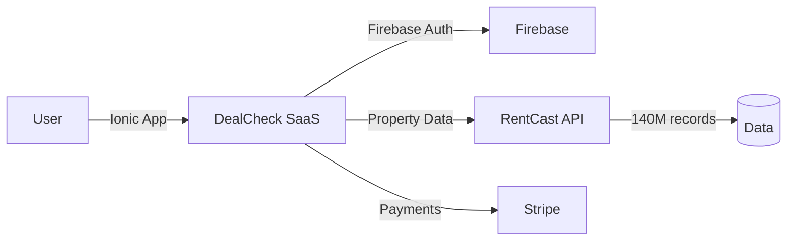

# DealCheck CI V6.5 Competitive Dossier
**Generated:** 2026-05-27 by SUMMIT-E  
**DOSSIER_ID:** d08d32b7-9159-4842-859b-d6bf87d47373  
**For:** Ariel Shapira / Everest Capital USA — INTERNAL USE ONLY  
**Status:** READY_FOR_SIGNOFF

---

## Executive Summary

DealCheck is a freemium B2C real estate deal analysis calculator, founded July 31, 2015 by Anton Ivanov under the legal entity **Fortnoff Financial LLC**. It serves 350,000+ retail real estate investors across all 50 US states with tools for rental analysis, fix-and-flip calculations, BRRRR modeling, and multi-family/commercial property analysis.

**Critical finding**: DealCheck and RentCast are **sister companies by the same founder**. DealCheck uses RentCast's REST API as its property data source. This means the "RentCast pricing" hypothesis for BidDeed's MCP must be evaluated against RentCast's API tier specifically — DealCheck's $20/mo ceiling is a B2C retail product and is not comparable to BidDeed's B2B MCP.

---

## Company Profile

| Field | Value | Confidence |
|---|---|---|
| Legal entity | Fortnoff Financial LLC | VERIFIED (App Store) |
| Founded | 2015-07-31 | VERIFIED (App Store) |
| Founder | Anton Ivanov | VERIFIED (About page) |
| Founder background | US Navy veteran, 40 rental units, $20k+/mo passive income | VERIFIED |
| Also founded | RentCast | VERIFIED (blog post Oct 2023) |
| Funding | Bootstrapped | INFERRED (0 SEC Form D filings) |
| Employees | ~5-15 | INFERRED |
| Jurisdiction | UNKNOWN | UNKNOWN (OpenCorporates no results) |
| HQ | UNKNOWN | UNKNOWN |
| Users | 350,000+ | VERIFIED (App Store description + About) |
| iOS rating | 4.85/5 (1,724 reviews) | VERIFIED (App Store API) |

---

## Product Architecture

### Pricing Tiers (VERIFIED)

| Tier | Price | Saved Properties | Comps | Templates |
|---|---|---|---|---|
| STARTER | $0/mo | 15 | 5 | 5 |
| PLUS | $10/mo ($7.50 yearly) | 50 | 10 | 10 |
| PRO | $20/mo ($15 yearly) | Unlimited | Unlimited | Unlimited |

All paid plans include 14-day free trial. Yearly plan = 3 months free.

**No enterprise tier. No API tier. No custom pricing.**

### Technology Stack (VERIFIED)

```
Marketing site: WordPress + Apache + Let's Encrypt + Cloudflare CDN
App (app.dealcheck.io): Ionic Framework + Firebase v11.8.0
  - Firebase Auth (Email / Google / Apple / Facebook SSO)
  - Firebase Realtime Database
  - Firebase Storage
  - Firebase Analytics
  - Stripe v3 (payments)
  - Google Maps API
  - Fastly CDN
  - Intercom (support chat)
  - FirstPromoter (affiliates)
  - Google Analytics + GTM (tracking)
```

### Data Architecture (VERIFIED)

DealCheck has **no proprietary data**. All property data (values, rents, comps, AVM) is sourced from:
- **RentCast API** (140M+ properties, nationwide) — same founder's API company
- Property records import (public records)
- User-entered data



### API Status (VERIFIED)

**DealCheck has NO public API.** The blog post from Oct 2023 announcing "Our New RentCast Property Data API" refers to RentCast's API (rentcast.io/api), not DealCheck's own API. DealCheck is a pure consumer product — no developer documentation, no API keys, no endpoints.

**No MCP server exists or has been announced.**

---

## Competitive Position vs BidDeed

### Where DealCheck Wins
1. **Scale**: 350K users, 11-year brand, featured by Forbes/BiggerPockets/MSN
2. **Mobile**: Native iOS + Android app (Ionic)
3. **Nationwide**: All 50 US states via RentCast
4. **Price**: Free tier drives massive adoption funnel
5. **Feature completeness**: IRR, GRM, BER, DCR, NOI, cash flow projections all in one tool

### Where BidDeed Wins
1. **Auction specialization**: 356K FL foreclosure records — DealCheck has zero auction tooling
2. **Proprietary data**: Real-time Brevard pipeline; DealCheck uses external API
3. **API/MCP infrastructure**: BidDeed building V14; DealCheck has none
4. **Patent position**: 14 claims filed; DealCheck has ZERO
5. **B2B pricing model**: BidDeed $99-2,999/mo; DealCheck tops at $20/mo (different markets)

---

## Patent & IP Analysis

| Search | Result | Confidence |
|---|---|---|
| USPTO patents (DealCheck/Fortnoff/Ivanov) | **0 patents** | VERIFIED |
| Trademark DEALCHECK | UNTESTED (TESS CAPTCHA) | UNTESTED |
| Federal litigation | **0 cases** | VERIFIED (CourtListener) |
| State litigation | UNKNOWN | UNKNOWN |
| Prior art risk - Shapira Triangle | **NONE** | VERIFIED |

No prior art conflict with Shapira Triangle Claims 8 (stacked ensemble for distressed auctions), 13 (convergence detection), or 14 (cycle intelligence).

---

## Sibling Reports

### Tech Stack (VERIFIED)
- Frontend: Ionic (mobile-first), WordPress (marketing)
- Backend: Firebase BaaS (no traditional server)
- Auth: Firebase Auth
- Payments: Stripe
- Analytics: GA4 + GTM
- Support: Intercom
- CDN: Fastly (app), Cloudflare (libs)

### Traffic (INFERRED/UNKNOWN)
- 350,000+ registered users (VERIFIED from site)
- iOS: 4.85/5, 1,724 reviews (VERIFIED App Store)
- SimilarWeb monthly visits: UNKNOWN (bot detection blocked access)
- GEO citations: UNKNOWN (Gemini quota exhausted, DeepSeek key missing)

### Founding / Corporate
- Founded 2015 as Ionic mobile app
- Fortnoff Financial LLC (legal entity)
- No external funding (0 SEC Form D filings)
- Solo founder model; small team

---

## Phases Completed

- [x] P1: Recon (12 URLs scraped, 5 screenshots)
- [x] P2: Tech footprint (Firebase stack VERIFIED, NO API VERIFIED)
- [x] P3: Team/founding (Anton Ivanov profile, Fortnoff Financial, 2015 founding)
- [x] P4a: BuiltWith (Ionic + Firebase confirmed)
- [x] P4b: SimilarWeb — BLOCKED (CAPTCHA)
- [x] P4c: GEO citations — BLOCKED (Gemini quota, DeepSeek missing)
- [x] P5: Patents — VERIFIED zero
- [x] P6: Battle card written

---

*Part of SUMMIT-E CI V6.5 dual dossier (RentCast + DealCheck). See rentcast-v5-REFERENCE.md for combined synthesis.*
