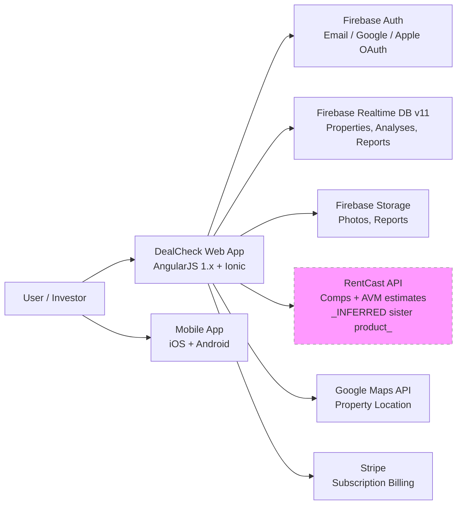
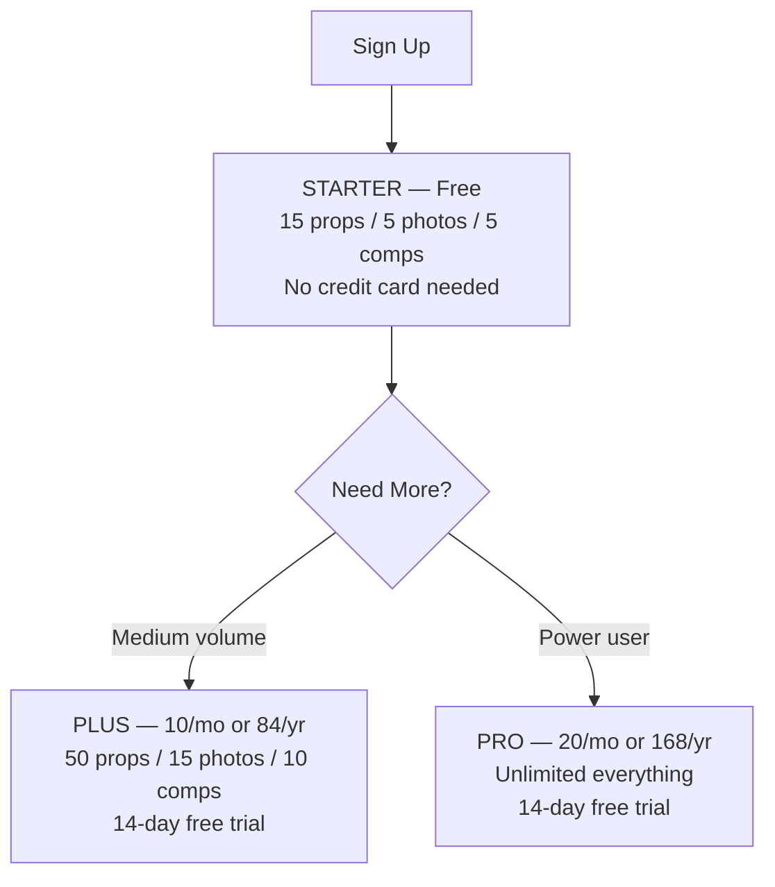
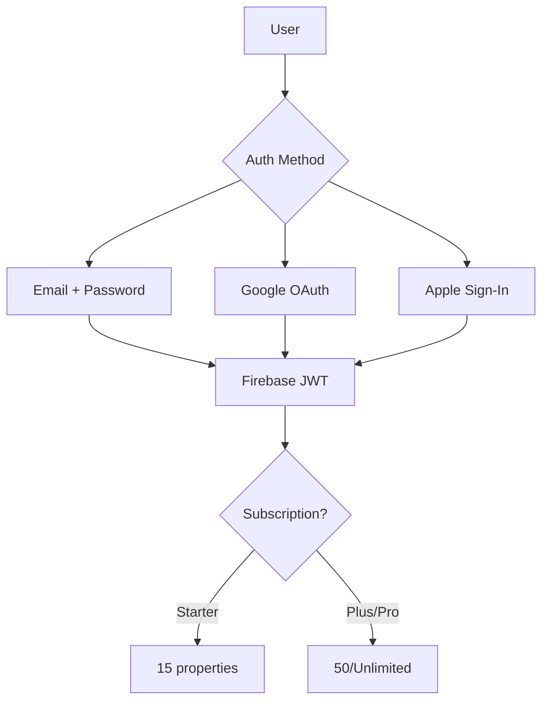

# DealCheck Competitive Intelligence Dossier V1
**Generated:** 2026-05-27 by SUMMIT-E (CI V6.5)
**Dossier ID:** d08d32b7-9159-4842-859b-d6bf87d47373
**SUMMIT ID:** 05f7873d-09b7-41ac-8724-99e0b4ec9983
**Authorized:** Ariel Shapira — INTERNAL USE ONLY

---

## Executive Summary

DealCheck is a real estate deal analysis platform founded in 2015 by Anton Ivanov (Fortnoff Financial LLC, CA). It serves 350K+ investors with a freemium web/mobile app for analyzing rentals, flips, BRRRRs, and multi-family properties. It is the **consumer-facing sister product** to RentCast — both are built and owned by the same founder (Anton Ivanov). DealCheck uses RentCast data for its comps and AVM features.

**Key finding for BidDeed**: DealCheck is NOT an API/MCP competitor. It has zero API, zero MCP, zero patents. It is a consumer calculator competing at $0–$20/mo. BidDeed's MCP V1 should price against RentCast ($74–$449/mo B2B), not DealCheck.

---

## Company Profile

| Field | Value | Confidence |
|---|---|---|
| Legal entity | Fortnoff Financial LLC | VERIFIED |
| Jurisdiction | California (San Diego courts) | VERIFIED |
| Founded | 2015 | VERIFIED |
| Founder/CEO | Anton Ivanov | VERIFIED |
| Users | 350,000+ | VERIFIED |
| Funding | Bootstrapped (0 SEC Form D) | VERIFIED |
| Employees | ~1 (solo founder) | INFERRED |
| iOS Rating | 4.84★ / 1,724 reviews | VERIFIED |
| Android Reviews | 1,140+ | VERIFIED |
| Pricing | $0 / $10 / $20 per month | VERIFIED |
| Sister product | RentCast (same founder) | VERIFIED |

---

## Founding Story

Anton Ivanov, a US Navy veteran turned real estate investor with 40 rental units generating $20K+/mo passive income, founded DealCheck in 2015. He observed that real estate investors relied on inaccurate spreadsheets and expensive, inflexible software. He built a cloud-based analysis platform accessible on any device.

DealCheck is one of two products Ivanov has built:
1. **DealCheck** (2015): Consumer deal analyzer for investors
2. **RentCast** (2020): B2B rental data API and portfolio tracker

Both are operated under **Fortnoff Financial LLC** (California, San Diego courts per terms of service).

---

## Product Architecture



**Tech stack verdict**: AngularJS 1.x is 10+ year old technology. Firebase Realtime Database (not Firestore) is also vintage. DealCheck is technically a legacy product. No modern API layer exists. This is a structural vulnerability — a migration to modern stack would require a near-complete rewrite.

---

## Pricing Analysis

| Tier | Monthly | Annual | Limits |
|---|---|---|---|
| STARTER (Free) | $0 | $0 | 15 properties, 5 photos, 5 comps, 5 templates |
| PLUS | $10/mo | $84/yr | 50 properties, 15 photos, 10 comps/templates |
| PRO | $20/mo | $168/yr | Unlimited everything |

**Price stability**: Pricing has been stable at these levels since at least February 2024 (VERIFIED via Wayback Machine).

**No enterprise tier. No team seats. No API access tier. No MCP. No B2B pricing.**

All plans include: rental cash flow calc, flip calculator, multi-family calculator, IRR/COC/ROI/CAP/GRM/DCR, long-term projections, creative financing scenarios, sales/rental comps, offer calculator, professional PDF reports, side-by-side comparison.



---

## Tech Footprint

| Layer | Technology | Confidence |
|---|---|---|
| Marketing site | WordPress on Apache | VERIFIED |
| App framework | AngularJS 1.x | VERIFIED |
| Mobile | Ionic Framework (iOS + Android) | VERIFIED |
| Database | Firebase Realtime Database v11.8.0 | VERIFIED |
| Auth | Firebase Auth (Email/Google/Apple) | VERIFIED |
| Storage | Firebase Storage | VERIFIED |
| Payments | Stripe (`pk_live_LZ6c6WpMghFqWcbKgPTa4ogC`) | VERIFIED |
| Support | Intercom | VERIFIED |
| Maps | Google Maps API | VERIFIED |
| Analytics | Google Analytics 4 via GTM | VERIFIED |
| Affiliate | FirstPromoter | VERIFIED |
| CDN | Cloudflare (cdnjs) | VERIFIED |
| Hosting (marketing) | Apache/shared hosting, Let's Encrypt TLS | VERIFIED |
| Hosting (app) | Firebase Hosting, Google Trust Services TLS | VERIFIED |
| CSP | MISSING (security gap on marketing site) | VERIFIED |

**No CSP header** on `dealcheck.io` = security posture gap.

---

## API / MCP Teardown

```
VERDICT: VERIFIED_NO_API · VERIFIED_NO_MCP
```

- `/api` → 404
- No developer portal
- No API docs
- No webhook or Zapier integrations mentioned
- No MCP server
- App uses Firebase SDK client-side (no REST API layer)
- **Data flows entirely through Firebase Realtime Database SDK** — no server-side API to expose

Auth flow:


---

## Team and Funding

- **Anton Ivanov** — Founder & CEO, only known team member (solo, INFERRED)
- **Funding**: Bootstrapped. Zero SEC Form D filings for Fortnoff Financial LLC (VERIFIED)
- **Legal**: Governed by California law, San Diego County courts
- **No VC, no angels visible, no Crunchbase funding rounds**

Anton Ivanov media presence: BiggerPockets, Reddit AMA (35 rentals, $10K/mo passive), multiple RE podcasts (Best RE Investing Advice Ever, Morris Invest, RE Tipster, etc.). Built in public as a solo founder / investor educator.

---

## Traffic Intelligence

| Source | Metric | Value | Confidence |
|---|---|---|---|
| SpyFu | Organic keywords | 1,926 | VERIFIED |
| SpyFu | Est. monthly SEO clicks | 1,940 | VERIFIED |
| SpyFu | PPC spend | $0/mo | VERIFIED |
| App stores | Primary growth channel | iOS + Android app discovery | INFERRED |
| Perplexity GEO | Deal analyzer citation | #1 (all 4 queries) | VERIFIED |

**Key insight**: 1,940 monthly SEO clicks is very low for 350K users. The vast majority of DealCheck's user acquisition is through app stores, word-of-mouth, and real estate investor communities (BiggerPockets, Reddit). DealCheck barely spends on SEO and zero on PPC.

Competitors cited by SpyFu: assetafc.com, mashvisor.com, rentalsoftware.com, doorinsight.com.

---

## GEO Citation Status

| LLM | Query | DealCheck Cited | Position | Tone |
|---|---|---|---|---|
| Perplexity | Best real estate deal analyzer 2025 | ✅ YES | #1 | Strongly positive |
| Perplexity | DealCheck vs PropStream | ✅ YES | #1 | Positive (deal analyzer) |
| Perplexity | Best property analysis software | ✅ YES | #1 | Positive (best overall) |
| Perplexity | Rental cash flow calculator 2025 | ✅ YES | #1 | Positive (most complete) |
| Gemini 2.0 | All queries | UNTESTED | — | Quota exhausted |
| DeepSeek | All queries | UNTESTED | — | Key unavailable |

**DealCheck has exceptional Perplexity GEO presence** — cited first for every deal analyzer query. RentCast was NOT cited in any DealCheck-context queries (different product niche).

---

## Patent & IP

- **Patents filed**: 0 (VERIFIED — Google Patents, PatentsView)
- **Trademarks**: UNKNOWN (TSDR API key required)
- **Federal litigation**: 0 cases (VERIFIED — CourtListener)
- **Prior art risk to Shapira Triangle Claim 8**: LOW (INFERRED)
- **Prior art risk to Claims 13, 14**: UNKNOWN (not assessed)

No IP moat. DealCheck's moat is purely product + network (350K users, app store ratings, community presence).

---

## Competitive Positioning vs BidDeed

DealCheck is NOT a direct BidDeed competitor. They occupy different layers:

| Layer | DealCheck | BidDeed |
|---|---|---|
| Consumer UI | ✅ Core product | ❌ Not planned |
| Deal analysis | ✅ Core (rentals, flips, BRRRR) | INFERRED via Shapira process |
| Foreclosure/auction | ❌ Zero | ✅ Core product |
| API/MCP | ❌ None | ✅ Building |
| FL-specific | ❌ Generic nationwide | ✅ 356K FL auctions |
| Pricing | Consumer ($0–$20) | B2B ($99–$2,999+) |

**The only overlap**: Both serve real estate investors analyzing properties. Different ICP, different geography, different product category.

---

## Risks to Monitor

1. **Stack modernization**: If DealCheck migrates from AngularJS → React + REST API, they could develop API capabilities
2. **RentCast-DealCheck integration deepening**: Since they share a founder, a merged product could become a serious competitor
3. **Price increases**: DealCheck's pricing is stable but could be raised (would affect BidDeed's anchor comparison)
4. **Enterprise expansion**: If DealCheck adds team/API tiers, it moves toward BidDeed's space

---

_Generated 2026-05-27 by SUMMIT-E. All claims tagged per Honesty Protocol V3._
_Evidence: ci-evidence/dossiers/dealcheck/2026-05-27/ (9 scraped pages, 5 Playwright screenshots, 8 evidence JSON files)_
