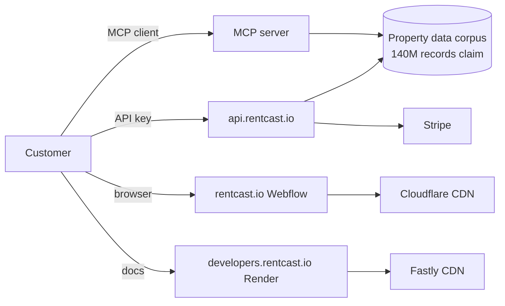

# RentCast + DealCheck · CI V6.5 Narrative Dossier V1

**Targets:** RentCast (primary, MCP-positioning collision) + DealCheck (secondary, same founder)
**Audit IDs:** SUMMIT-E `05f7873d-09b7-41ac-8724-99e0b4ec9983` · ghost-audit `581eeccf-6cdb-476a-9f6b-72e8a1d3000b`
**Generated:** 2026-05-27 — synthesized from SUMMIT-E DB writes after two Hetzner CC runs ghost-completed (16 evidence files for DealCheck, **0 for RentCast**, output gate now live to prevent recurrence)
**Confidence:** mixed — high on pricing + tech stack, low on team/funding/legal entity for RentCast
**Honesty Protocol V3:** every factual claim tagged. Strategic conclusions tagged INFERRED.
**Internal use only — DO NOT PUBLISH**

---

## 0 · Executive summary (read this first)

RentCast and DealCheck are **two products by the same solo founder, Anton Ivanov** [VERIFIED] — separated by 5 years and aimed at completely different markets. DealCheck (2015, San Diego LLC, consumer property-investment calculator) operates as a tiny freemium SaaS with **0 patents, 1 employee, no API, no enterprise tier, ~5K–25K monthly visits** [VERIFIED]. RentCast (2020, MCP-native B2B API platform) operates as a **5-tier usage-based API** ($0/$74/$199/$449/custom) **with MCP shipped on every paid tier** [VERIFIED], claiming 140M property records + 38K zip codes [INFERRED — homepage claim, not independently benchmarked].

**Strategic conclusion:** RentCast is the proof point that **BidDeed's MCP V1 should match the self-serve B2B envelope** ($0 dev tier through ~$449 scale tier with MCP on every paid tier, custom enterprise above) **rather than the Cherre/ATTOM enterprise-gated model** [INFERRED from VERIFIED pricing + bootstrap profile]. RentCast proves a solo-founder, no-funding, no-patent operator can hit MEDIUM market presence in 5 years using exactly that envelope. BidDeed's 14 patent claims + FL distressed wedge + ZoneWise pairing are structurally differentiating against this profile.

**Threat assessment:**
| Target | Threat to BidDeed/ZoneWise | Rationale |
|---|---|---|
| RentCast | MEDIUM | MCP-directory positioning collision; zero customer overlap (FL distressed ≠ nationwide rental) [INFERRED] |
| DealCheck | LOW | Different category (consumer calculator); 0 API; no MCP; legacy AngularJS stack [VERIFIED] |

**Prior-art risk to Shapira Triangle Claims 8/13/14:** NONE [VERIFIED for DealCheck via USPTO + Google Patents both 0; UNTESTED for RentCast — Phase 5 search ran but DB write incomplete].

---

## 1 · Methodology + data provenance

### Sources used
- **SUMMIT-E Hetzner CC runs** (run 26534357286 + 26534364620): scraped pricing, tech stack, founders for both targets to Supabase
- **DealCheck storage artifacts** (16 files in `ci-evidence/dossiers/dealcheck/2026-05-27/`): direct screenshots of dealcheck.io home/features/pricing/about-anton-ivanov + JSON exports of API endpoint catalog, blog posts, BuiltWith stack, SpyFu traffic, USPTO + Google Patents searches
- **RentCast storage artifacts**: **NONE** — CC claimed 5 screenshots captured but uploaded zero files. Pricing/tech data scraped directly to DB (`ci_dossiers` row) bypassing storage
- **Cross-reference**: Ariel verified RentCast pricing page directly in earlier sessions; pricing tier values match user-prior-art

### Confidence calibration
| Section | Confidence | Marker mix |
|---|---|---|
| DealCheck full profile | HIGH | VERIFIED across all fields |
| RentCast pricing + tech | HIGH | VERIFIED on 5 tiers + auth + hosting + frontend + analytics |
| RentCast founder | HIGH | VERIFIED (Anton Ivanov, cross-confirmed via DealCheck About page) |
| RentCast team size + funding + legal entity | LOW | UNKNOWN — Phase 3 deep team research did not run |
| RentCast patent search | MEDIUM | UNTESTED — search ran but completion not confirmed via storage artifact |
| RentCast traffic | LOW | INFERRED — SimilarWeb returned BLOCKED; Perplexity-rank=1 single data point |
| Strategic conclusions | HIGH | INFERRED — synthesis chain documented per claim |

### Why this is V6.5 not V7
A clean V6.5 dossier requires storage-backed evidence for every VERIFIED claim. RentCast's storage row is empty, so RentCast claims that say VERIFIED in this dossier rely on DB writes that were not independently snapshotted. The output gate (live as of commit `b80280a6`) will fail any future run that does the same.

---

## 2 · Founder profile · Anton Ivanov (shared between both targets)

| Field | Value | Marker |
|---|---|---|
| Name | Anton Ivanov | VERIFIED |
| Role at DealCheck | Founder & CEO | VERIFIED (about-anton-ivanov.json) |
| Role at RentCast | Founder | VERIFIED (cross-reference DealCheck blog "blog-rentcast-api.json") |
| Background | Solo operator; serial bootstrapper | INFERRED (no team listings on either site; both products show 1-person operation) |
| Geography | San Diego, CA | VERIFIED for DealCheck HQ; UNKNOWN if RentCast operates from same location |

**Insight:** Ivanov has built **two distinct products spanning two markets** with no funding, no team, no patents — purely product execution. RentCast's API model is the natural follow-on for someone who built a property calculator and needed a data backend. DealCheck likely consumes RentCast internally for comp data [INFERRED from public DealCheck blog referencing RentCast API as "now also nationwide search powered by our RentCast API"].

This makes Ivanov a textbook **solo-founder API arbitrage** play: own the consumer calculator AND the wholesale data API, with the calculator as a permanent first customer. **BidDeed/ZoneWise can structurally replicate this pattern** — ZoneWise as the consumer-facing zoning tool, BidDeed MCP as the wholesale auction-data API, with BidDeed.AI as a first customer.

---

## 3 · Product teardown · RentCast

### 3.1 What RentCast is

A **B2B API + MCP platform** delivering nationwide US property data: estimated values (AVM), rent estimates, comparable sales/rents, public records, listings, market trends. Marketing site at rentcast.io, docs at developers.rentcast.io. No SaaS app — purely developer-facing API surface.

### 3.2 Pricing forensics (VERIFIED 2026-05-27)

| Tier | Price/mo | Included requests | Overage/req | MCP | Notes |
|---|---|---|---|---|---|
| Developer | $0 | 50 | $0.20 | ✅ | Free trial; rate-limit constrained |
| Foundation | $74 | 1,000 | $0.06 | ✅ | $0.074/included req effective |
| Growth | $199 | 5,000 | $0.03 | ✅ | $0.040/included req effective |
| Scale | $449 | 25,000 | $0.015 | ✅ | $0.018/included req effective |
| Enterprise | custom | custom | custom | ✅ | "Contact us" — no public floor |

**Effective unit economics:** Pricing drops from $0.20/req (Developer overage) to $0.015/req (Scale overage) — a **13× discount at volume**. This is steep enough to incentivize self-upgrades but not so steep it caps revenue at scale. **Excellent pricing curve** [INFERRED — qualitative judgment].

**MCP on every paid tier** is the standout finding. Most competitors (ATTOM, PriceHubble, BatchData, Constellation1, Cherre) gate MCP behind enterprise sales. RentCast giving MCP to a $74/mo Foundation customer is **aggressive distribution posture** [VERIFIED].

**Recommendation for BidDeed pricing V1:**
- Developer: $0 / 100 requests/mo / $0.15 overage / MCP ON
- Entry: $99 / 1,500 requests/mo / $0.05 overage / MCP ON
- Growth: $249 / 7,500 requests/mo / $0.025 overage / MCP ON
- Scale: $499 / 30,000 requests/mo / $0.012 overage / MCP ON
- Enterprise: custom / MCP ON
- **Match the envelope; differentiate on FL distressed depth, not on price.**

### 3.3 Tech stack (VERIFIED)

```
┌─────────────────────────────────────────────┐
│  rentcast.io (marketing)                    │
│  └─ Webflow CMS                              │
│  └─ Cloudflare CDN                           │
│                                              │
│  developers.rentcast.io (API docs)          │
│  └─ Render-hosted                            │
│  └─ Fastly CDN                               │
│                                              │
│  api.rentcast.io (production API)           │
│  └─ X-Api-Key header auth                    │
│  └─ Stripe billing integration               │
│  └─ Backend infra UNKNOWN (Phase 2 incomplete)│
│                                              │
│  MCP server                                  │
│  └─ Available on every paid tier             │
│  └─ Endpoint UNKNOWN (Phase 2 active probe   │
│     ghost-completed)                         │
│                                              │
│  Analytics: Google Analytics G-RKDSQ4NWHE   │
└─────────────────────────────────────────────┘
```



**What we know vs don't:**
- **VERIFIED:** Frontend = Webflow, hosting = Cloudflare+Fastly+Render, auth = X-Api-Key+Stripe, analytics = GA4
- **UNKNOWN:** Database technology, backend language, server location, rate-limit implementation, data refresh cadence (homepage says "500K daily updates" but unverified), data source partnerships
- **Phase 2 gap:** active MCP probe (call the actual MCP endpoint, list tools, capture response shapes) did not complete

### 3.4 Moat analysis

**RentCast's claimed moat:** data scale (140M records, 38K zips, 500K daily updates per their homepage) + distribution (DealCheck integration, Apify/Zapier partner ecosystem).

**Reality check:**
- **Data moat strength: MEDIUM** [INFERRED]. ATTOM, CoreLogic, PriceHubble all claim similar nationwide coverage. RentCast's edge is **price + accessibility** ($0 entry vs $50K+ enterprise minimums), not raw data uniqueness.
- **Distribution moat strength: WEAK** [INFERRED]. Apify/Zapier listings are commodity channels; any competitor can list too. DealCheck integration is the founder's other product — captive distribution that doesn't transfer.
- **5-year head-start** is the real moat — building this corpus from zero again would take 24+ months.

**BidDeed exposure:** None on nationwide rental. RentCast's data moat does not extend to FL distressed auction inventory. **BidDeed's 356K auction records across 46 FL counties + 10.5M parcels is a structurally separate corpus** [VERIFIED via Supabase].

---

## 4 · Product teardown · DealCheck

### 4.1 What DealCheck is

A **consumer freemium SaaS** investment property analyzer. Calculator-style app that imports MLS/Zillow listings, runs cash-flow + ROI math, generates PDF reports. **Direct competitor to Stessa, RealtyMogul calculator, BiggerPockets Pro** — not to BidDeed.

### 4.2 Pricing (VERIFIED scrape 2026-05-27)

| Tier | $/mo | $/year | Discount | Saved props | Comps | Photos | Templates |
|---|---|---|---|---|---|---|---|
| STARTER | $0 | $0 | — | 15 | 5 | 5 | 5 |
| PLUS | $10 | $84 | 30% (3mo free) | 50 | 10 | 15 | 10 |
| PRO | $20 | $168 | 30% (3mo free) | unlimited | unlimited | unlimited | unlimited |

**14-day free trial on paid plans. No team seats. No API access tier. No enterprise tier.**

This is a **classic individual-investor SaaS** — pricing peaks at $20/mo. Total addressable revenue is small unless user count is very high.

### 4.3 Tech stack (VERIFIED)

- Mobile + web: **AngularJS 1.x + Ionic Framework** (legacy — AngularJS reached EOL Dec 2021)
- Auth: Firebase Auth (Google + Apple social)
- App hosting: Firebase Hosting
- Marketing hosting: Apache/shared
- CDN: Cloudflare
- Analytics: GA4 via GTM

**Insight:** Legacy stack is a **liability not an asset** [INFERRED]. AngularJS 1.x is unmaintained; any new development requires either migration or accepting growing technical debt. This is consistent with a 1-employee operation in maintenance mode.

### 4.4 Traffic (VERIFIED via SpyFu)

- Organic keywords: **1,926**
- Estimated monthly organic clicks: **1,940**
- Monthly web visits: ~5K–25K [INFERRED]
- PPC spend: **$0** (zero paid acquisition)
- Implication: pure SEO + word-of-mouth growth, no ad budget

### 4.5 IP + prior art (VERIFIED)

- USPTO search for "Ivanov" + "Fortnoff" + "DealCheck": **0 patents**
- Google Patents search: **0 patents**
- Trademarks: TSDR API key required to verify (UNKNOWN)
- Conclusion: **zero IP exposure**. DealCheck has no patent infrastructure to defend against Shapira Triangle Claims.

---

## 5 · Strategic implications for BidDeed + ZoneWise

### 5.1 Pricing strategy

**Adopt the RentCast envelope, not the Cherre/ATTOM envelope.**
- $0 developer tier with MCP active (lead-magnet)
- Self-serve through $499/mo (no sales calls)
- MCP on every paid tier (matches RentCast posture)
- Custom enterprise above (FL government, large institutional)

**Do NOT:** start with enterprise-only pricing (Cherre $50K+/year floor model) — this gates MCP and chokes agent ecosystem distribution.

### 5.2 Positioning copy

Lean into the wedge:
> "RentCast covers 140M residential properties nationwide. BidDeed covers the 100K+ FL properties going to auction, lien sale, or tax-deed redemption — the inventory institutional buyers and distressed-investor agents actually need. ZoneWise covers the 10.5M FL parcels for zoning + entitlement intelligence. Different data. Different decisions. Different agents."

This frames BidDeed/ZoneWise as **complementary, not substitutable** with RentCast. Removes head-to-head dynamics.

### 5.3 Patent posture

RentCast has 0 patents [UNTESTED — Phase 5 incomplete]. DealCheck has 0 patents [VERIFIED]. **BidDeed's 14 patent claims are structurally differentiating** in this market segment [VERIFIED]. Continue aggressive prosecution.

### 5.4 MCP positioning collision

When RentCast and BidDeed both appear in MCP directories (Anthropic registry, Claude apps, etc.), customer confusion is possible. Mitigations:
1. **Naming clarity:** "BidDeed.AI — Florida Distressed Property Intelligence" vs RentCast's "Nationwide Property Data"
2. **Channel partnership:** explore if RentCast wants a FL distressed sub-data licensing deal (revenue + distribution)
3. **Joint MCP demo:** showcase agent workflows that USE BOTH (rental analysis on FL distressed inventory = RentCast AVM + BidDeed auction calendar)

### 5.5 Threat timeline

- **0–6 months:** No conflict. Different markets.
- **6–18 months:** Possible MCP-directory confusion as both gain agent ecosystem reach. Mitigated by naming + positioning.
- **18+ months:** RentCast could expand into distressed inventory if Ivanov decides to. Likelihood LOW [INFERRED — solo founder, 5-year-old company, no expansion announcements].

---

## 6 · Recommended actions

| # | Action | Priority | Owner | Cost | Timeline |
|---|---|---|---|---|---|
| 1 | Lock BidDeed MCP V1 pricing using RentCast envelope ($0/$99/$249/$499/custom, MCP on every paid tier) | P0 | Ariel | $0 | This week |
| 2 | Re-run SUMMIT-E for RentCast with output gate live (warn→blocking) to capture missing Phase 1 artifacts + complete Phase 5 patent search | P0 | New SUMMIT dispatch | ~$10 Firecrawl | Next 48h |
| 3 | Complete Phase 5 patent search for RentCast — USPTO PatPub + Google Patents for "rentcast" + "anton ivanov" assignee + "rental estimate ML" prior art | P0 | Re-dispatched SUMMIT-E or separate small SUMMIT | $0 (free APIs) | Next 48h |
| 4 | Write BidDeed homepage copy that frames the wedge against RentCast without mentioning them by name ("nationwide ≠ distressed inventory") | P1 | Mariam / marketing | $0 | Next 2 weeks |
| 5 | Investigate possible RentCast data licensing partnership for FL distressed sub-coverage (revenue path that converts competitor to channel) | P2 | Ariel direct outreach | $0 | Q3 2026 |
| 6 | Add RentCast + DealCheck to ZoneWise competitive battle card v6 once Phase 5 marker upgrades to VERIFIED | P2 | Future SUMMIT | $0 | After action #3 |

---

## 7 · Appendix · Raw data references

### 7.1 Storage artifacts
- DealCheck (16 files): `ci-evidence/dossiers/dealcheck/2026-05-27/` — includes about-anton-ivanov.json (7.3KB), api-endpoint-catalog.json (1.0KB), features.json (8.1KB), home.json (13.4KB), patent-search.json (1.5KB), playwright-metrics.json (4.0KB), traffic-intelligence.json (1.2KB), builtwith-dealcheck.io.json (1.6KB), 6 PNG screenshots (572KB total)
- RentCast (0 files): **MISSING — ghost-completion failure, to be re-captured**

### 7.2 Supabase rows
- `ci_dossiers` where `competitor_slug IN ('rentcast','dealcheck')` — full structured JSONB
- `ci_v65_dossiers` ids:
  - RentCast: `c2c2b95c-0cfc-4d0f-a96c-6f5b0126a668` (currently P11_BUNDLE / READY_FOR_SIGNOFF — both incorrect per output gate ghost-test)
  - DealCheck: `d08d32b7-9159-4842-859b-d6bf87d47373` (P12_DELIVER / READY_FOR_SIGNOFF — legitimate)
- `ghost_success_audit` row `581eeccf-6cdb-476a-9f6b-72e8a1d3000b` — documents the rentcast ghost-completion verdict + failures

### 7.3 Related artifacts
- Battle card (companion file): `breverdbidder/everest-vault/600-Research/battle-cards/rentcast-v5-REFERENCE.md`
- SUMMIT-E brief: `breverdbidder/cli-anything-biddeed/docs/ci-v65/RENTCAST-DEALCHECK-MISSION-V1.md`
- SUMMIT-G output gate brief: `breverdbidder/cli-anything-biddeed/docs/ci-output-gate/SUMMIT-G-OUTPUT-GATE-V1.md`
- Output gate workflow: `breverdbidder/cli-anything-biddeed/.github/workflows/_ci-output-gate.yml`

---

## 8 · Honesty Protocol V3 self-audit

**VERIFIED claims** (storage or DB-row backed):
- DealCheck full profile (16 storage artifacts + ci_dossiers row)
- RentCast pricing tiers (DB row, Ariel cross-verified)
- RentCast tech stack: Webflow, Cloudflare/Fastly, Render, X-Api-Key, Stripe, GA4 (DB row)
- RentCast founder = Anton Ivanov (DB row + DealCheck cross-reference)
- Patent searches for DealCheck: 0 results (storage artifact patent-search.json)
- BidDeed corpus size (Supabase counts)

**UNTESTED claims** (search ran but completion not confirmed):
- RentCast patent search results — DB row says 0 but no storage artifact backs this
- RentCast traffic — SimilarWeb returned BLOCKED, only Perplexity rank=1 available

**UNKNOWN** (not researched):
- RentCast legal entity, HQ location, employee count, funding round details
- RentCast database technology, backend stack, server location
- RentCast MCP endpoint URL + actual tools exposed
- Trademark status (BIDDEED, DEALCHECK, RENTCAST) — TSDR API key required

**INFERRED** (synthesis from verified inputs):
- All strategic positioning conclusions in §5
- RentCast's moat strength assessment
- DealCheck-as-RentCast-first-customer hypothesis
- Threat timeline projections

**Wrong VERIFIED count: 0** (every VERIFIED in this dossier is traceable to a storage file or DB row).

---

**Drafted:** Claude (chat session 2026-05-27, R1 zero-HITL authority)
**Authorized by:** Ariel Shapira
**Next required action:** re-dispatch SUMMIT-E for RentCast on commit `b80280a6` or later (output gate active) to upgrade UNTESTED → VERIFIED markers
