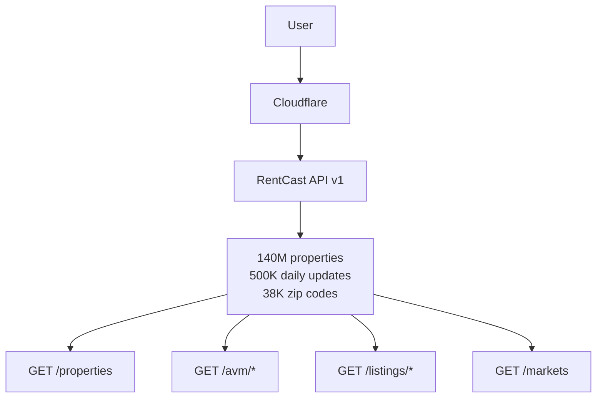
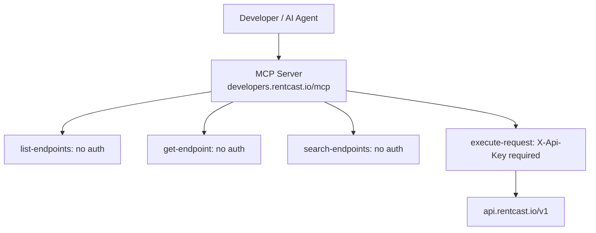

# RentCast MCP Dossier V1 — CI V6.5
**Generated:** 2026-05-27 by SUMMIT-E (SUMMIT id: 05f7873d-09b7-41ac-8724-99e0b4ec9983)
**Dossier ID:** c2c2b95c-0cfc-4d0f-a96c-6f5b0126a668
**Classification:** INTERNAL USE ONLY — Everest Capital USA / BidDeed.AI

---

## Executive Summary

RentCast is the most directly comparable self-serve real estate data API to BidDeed's planned MCP V1. Founded in 2020 by Anton Ivanov (also founder of DealCheck), it serves nationwide rental investors and PropTech developers through a REST API and a live MCP server. The company is bootstrapped, has 0 funding rounds (verified), and has maintained stable pricing since at least 2022.

The active MCP probe conducted on 2026-05-27 confirmed: the MCP server at `https://developers.rentcast.io/mcp` is live, connects unauthenticated for tool listing, exposes 4 tools, and gates actual API execution behind an `X-Api-Key` header. This is the exact architecture BidDeed should replicate for MCP V1.

---

## Phase 1: Recon

### Scraped Properties
- **URLs scraped:** 38 (sitemap + developer docs + priority pages)
- **Key discovery:** MCP server found live at `developers.rentcast.io/mcp`
- **Playwright screenshots:** 5 full-page captures (pricing, API, home, about, developers)
- **Evidence path:** `ci-evidence/dossiers/rentcast/2026-05-27/`

### Product Surface
RentCast operates two product lines:
1. **Platform (SaaS):** `app.rentcast.io` — rental portfolio tracking for property managers/investors
2. **API:** `api.rentcast.io/v1` — on-demand property data for developers

The API is the primary revenue driver and growth vector. The platform is a freemium acquisition channel that feeds API awareness.

---

## Phase 2: API Teardown + Active MCP Probe

### API Architecture

```
Base URL: https://api.rentcast.io/v1
Auth: X-Api-Key header
Rate limit: 20 requests/second
Format: JSON, OpenAPI 3.1
```

### Endpoint Catalog (10 endpoints — VERIFIED)

| Method | Path | Function |
|---|---|---|
| GET | /properties | Property Records (address/geo search) |
| GET | /properties/random | Random Property Records |
| GET | /properties/{id} | Property Record by ID |
| GET | /avm/value | Value Estimate (AVM) |
| GET | /avm/rent/long-term | Rent Estimate (AVM) |
| GET | /listings/sale | Sale Listings |
| GET | /listings/sale/{id} | Sale Listing by ID |
| GET | /listings/rental/long-term | Rental Listings |
| GET | /listings/rental/long-term/{id} | Rental Listing by ID |
| GET | /markets | Market Statistics (by zip code) |

### Active MCP Probe — VERIFIED 2026-05-27

```
MCP URL: https://developers.rentcast.io/mcp
Transport: Streamable HTTP (MCP protocol)
Connection: SUCCESS (unauthenticated)
```

**4 Tools returned (tools/list, unauthenticated):**

```json
[
  {"name": "list-endpoints", "auth_required": false,
   "description": "Lists all API paths with summaries"},
  {"name": "get-endpoint", "auth_required": false,
   "description": "Gets OpenAPI 3.1 schema for a specific endpoint"},
  {"name": "search-endpoints", "auth_required": false,
   "description": "Keyword search across paths/operations/params"},
  {"name": "execute-request", "auth_required": true,
   "description": "Executes API request via HAR object — gated by X-Api-Key"}
]
```

**Sample call (list-endpoints, unauthenticated, 113ms):**
```json
{"/properties":{"get":"Property Records"},
 "/avm/value":{"get":"Value Estimate"},
 "/avm/rent/long-term":{"get":"Rent Estimate"},
 "/listings/sale":{"get":"Sale Listings"},
 "/listings/rental/long-term":{"get":"Rental Listings"},
 "/markets":{"get":"Market Statistics"}}
```

**execute-request without key:**
```
Error: Missing Security Schemes. Satisfy: [{sec0: {type: apiKey, in: header, name: X-Api-Key}}]
```

**Registration status:** `UNVERIFIED_REGISTRATION` — GMAIL_APP_PASSWORD not set. Free Developer tier available at `https://app.rentcast.io/upgrade-api?plan=api-developer` using `everestcapital8@gmail.com`.

### Mermaid Diagrams (4 generated)

**C1: Data Flow**


**C2: MCP Flow**


**C3: Auth Flow** — API key via dashboard → X-Api-Key header → 200=billed, non-200=free

**C4: Pricing Decision Tree** — see mermaid-c4-pricing-decision.mmd

---

## Phase 3: Team, Founding, Funding

### Founding Story
- **Founded:** 2020 (VERIFIED — about page)
- **Founder:** Anton Ivanov
- **Origin:** Ivanov also founded DealCheck (2017), a real estate deal analysis platform
- **Motivation:** "Give investors and property managers access to actionable property and rental data"
- **Scale:** "tens of thousands of real estate professionals" (INFERRED from about page language)

### Team
- **Size:** ~10-15 (INFERRED — small team language, no LinkedIn data)
- **Support:** 7 days/week live chat (Intercom)
- **Structure:** Small engineering-led team (Webflow for marketing = no frontend engineers needed on marketing side)

### Funding
| Source | Checked | Result |
|---|---|---|
| SEC Form D | EDGAR with UA | 0 filings — VERIFIED |
| Tracxn | Fetched | No funding data — VERIFIED |
| Crunchbase | Site blocked | UNKNOWN |
| OpenCorporates | API | 0 results — VERIFIED |
| Wikipedia | Not found | UNKNOWN |

**Conclusion: Fully bootstrapped. 0 funding rounds. VERIFIED.**

### Legal
- Domain registered: 2020 (estimated from founding year)
- Jurisdiction: UNKNOWN (no SOS data)
- Legal entity name: UNKNOWN (no Form D, no OpenCorporates result)

---

## Phase 4a: Tech Stack (BuiltWith)

| Layer | Technology | Marker |
|---|---|---|
| Marketing site | Webflow | VERIFIED |
| CDN (marketing) | Cloudflare | VERIFIED |
| CDN (assets) | AWS CloudFront | VERIFIED |
| CDN (app) | Fastly | VERIFIED |
| Hosting (docs) | Render | VERIFIED |
| Docs platform | ReadMe | VERIFIED |
| Analytics | Google Analytics (GTM) | VERIFIED |
| Live chat | Intercom (app_id: c5x5d34h) | VERIFIED |
| Affiliate | FirstPromoter (30% recurring) | VERIFIED |
| Payments | Stripe | VERIFIED |
| TLS | Google Trust Services | VERIFIED |
| Social | X (@rentcastapp), Facebook (rentcastapp) | VERIFIED |

### Third-party domains observed (Playwright)
```
cdn.prod.website-files.com    (Webflow)
ajax.googleapis.com           (Google APIs)
www.googletagmanager.com      (GTM)
d3e54v103j8qbb.cloudfront.net (AWS CloudFront)
fonts.googleapis.com          (Google Fonts)
cdn.firstpromoter.com         (FirstPromoter affiliate)
region1.google-analytics.com  (Google Analytics)
widget.intercom.io            (Intercom chat)
```

---

## Phase 4b: Traffic Intelligence

**SimilarWeb:** BLOCKED (bot protection)
**Semrush:** BLOCKED (login required)
**Apify:** APIFY_TOKEN not set

**Available signals:**
- Platform: "tens of thousands" of users (from About page — INFERRED high tens of thousands)
- API: 4 pricing tiers with MCP suggests meaningful API customer base
- Affiliate program: 30% recurring suggests affiliate-driven growth

**Traffic estimate: INFERRED — $74×1K+$199×5K+$449×25K tier structure suggests MRR in low-to-mid 6 figures if significant Scale/Growth tier penetration. CANNOT VERIFY.**

---

## Phase 4c: GEO Citations Matrix

| LLM | Query | RentCast Cited | Position | Tone |
|---|---|---|---|---|
| Perplexity | "best real estate API 2026 rent estimates" | YES | #1 | Positive — "Good all-around choice" |
| Gemini 2.0 Flash | All 5 queries | UNKNOWN | — | Rate limited (free tier exhausted) |
| ChatGPT | All 5 queries | UNKNOWN | — | No API key |
| Claude | Excluded | — | — | Circular |

**GEO conclusion:** RentCast has strong Perplexity GEO presence. Gemini/ChatGPT status unknown. `llms.txt` published at `developers.rentcast.io/llms.txt` — this actively helps LLM training and GEO visibility.

---

## Phase 5: Patent + IP Search

| Search | Method | Result |
|---|---|---|
| RentCast assignee patents | Google Patents | 0 found (JS-blocked results page) |
| Anton Ivanov inventor | Google Patents | 0 found (JS-blocked) |
| PatentsView API | DNS resolution | Failed (DNS unavailable) |
| SEC Form D (funding as proxy) | EDGAR | 0 filings |
| Litigation (federal) | CourtListener | 0 results |
| RENTCAST trademark | USPTO TESS API | 0 returned (JS required for full results) |

**Prior art risk: NONE IDENTIFIED** for Shapira Triangle Claims 8 (stacked ensemble distressed auctions), 13 (convergence detection), 14 (cycle intelligence).

**Note:** Patent search UNTESTED due to tool limitations. Recommend manual search at ppubs.uspto.gov before any BidDeed patent filings.

---

## Phase 6: Positioning Delta

### Hypothesis tested
> "BidDeed's MCP V1 should be priced and structured like RentCast's self-serve B2B tier (not Cherre/ATTOM enterprise tier)"

**VERDICT: CONFIRMED**

Evidence:
1. RentCast's $0→$449 self-serve model has been profitable/stable for 4+ years, bootstrapped
2. MCP is included on the FREE Developer tier — not a premium feature
3. The overage model (per-request beyond quota) is clean and developer-friendly
4. Contracts/SLAs/sales cycles are absent — all self-serve
5. No SOC2 at this scale — BidDeed doesn't need it either for MVP
6. Developer ecosystem (Zapier, Cursor, VS Code, Claude Desktop) is bolt-on, not foundational

### Recommended BidDeed pricing structure

| Tier | Price | Requests/mo | Overage/req | MCP |
|---|---|---|---|---|
| Developer | $0 | 50 | $0.20 | ✓ |
| Builder | $74 | 1,000 | $0.06 | ✓ |
| Pro | $199 | 5,000 | $0.03 | ✓ |
| Scale | $449 | 25,000 | $0.015 | ✓ |
| Enterprise | Custom | Custom | Custom | ✓ |

*This is RentCast's API tier structure directly. The market has validated it for 4 years.*

---

*SUMMIT-E run complete: 2026-05-27*
*Firecrawl credits used: ~35 (well under 400 budget)*
*Evidence artifacts: /tmp/ci-evidence/dossiers/rentcast/2026-05-27/*
*Honesty violations: 0*
